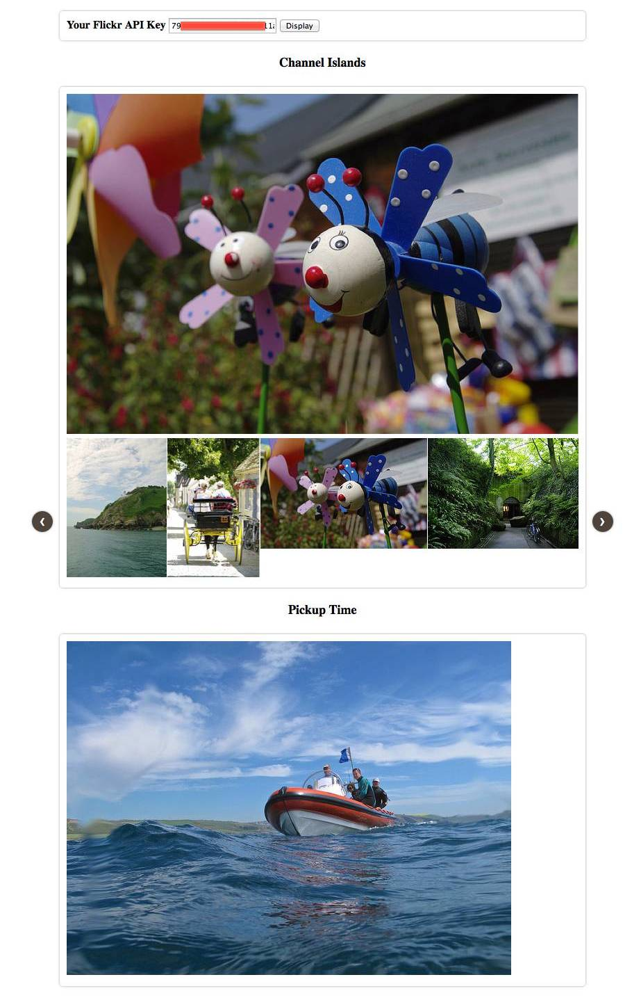

Photoset Gallery
================

.. contents:

Introduction
------------

Generates a gallery from a photoset on Flickr with links referring to the
originals. This provides a JQuery plugin which uses the excellent psgallery
to manage the gallery side of things.

Usage
-----

Clone the repository and open demo-gallery.html in a browser. You will need to
provide your Flickr API key. Paste it into the input and press Display and you
should see:

The HTML contains the following data-photoset attribute which tells the library
what photoset to use. In this case this is my Channel Islands Flickr photoset
https://www.flickr.com/photos/oisinmulvihill/sets/72157606132043161/

.. code-block:: html

    

    :
    etc

Multiple galleries are supported on one page. The following snippet of code
sets up the library to look for all elements with the class "psgallery-set".
This is only need once when the document is ready.

.. code-block:: javascript

    $.photoset.gallery.init({
        api_key: api_key
    });

Dependancies
------------

In the demo I was using JQuery 2.1.0 and Carousel 0.3.1 over CDN:

.. code-block:: html

    
    

psgallery
~~~~~~~~~

 * http://sorgalla.com/psgallery/

License
-------

Copyright (c) 2014, Oisin Mulvihill
All rights reserved.

Redistribution and use in source and binary forms, with or without
modification, are permitted provided that the following conditions are met:

 * Redistributions of source code must retain the above copyright notice, this
   list of conditions and the following disclaimer.
 * Redistributions in binary form must reproduce the above copyright notice,
   this list of conditions and the following disclaimer in the documentation
   and/or other materials provided with the distribution.
 * Neither the name of Oisin Mulvihill nor the names of its contributors may
   be used to endorse or promote products derived from this software without
   specific prior written permission.

THIS SOFTWARE IS PROVIDED BY THE COPYRIGHT HOLDERS AND CONTRIBUTORS "AS IS"
AND ANY EXPRESS OR IMPLIED WARRANTIES, INCLUDING, BUT NOT LIMITED TO, THE
IMPLIED WARRANTIES OF MERCHANTABILITY AND FITNESS FOR A PARTICULAR PURPOSE ARE
DISCLAIMED. IN NO EVENT SHALL THE COPYRIGHT OWNER OR CONTRIBUTORS BE LIABLE
FOR ANY DIRECT, INDIRECT, INCIDENTAL, SPECIAL, EXEMPLARY, OR CONSEQUENTIAL
DAMAGES (INCLUDING, BUT NOT LIMITED TO, PROCUREMENT OF SUBSTITUTE GOODS OR
SERVICES; LOSS OF USE, DATA, OR PROFITS; OR BUSINESS INTERRUPTION) HOWEVER
CAUSED AND ON ANY THEORY OF LIABILITY, WHETHER IN CONTRACT, STRICT LIABILITY,
OR TORT (INCLUDING NEGLIGENCE OR OTHERWISE) ARISING IN ANY WAY OUT OF THE USE
OF THIS SOFTWARE, EVEN IF ADVISED OF THE POSSIBILITY OF SUCH DAMAGE.
